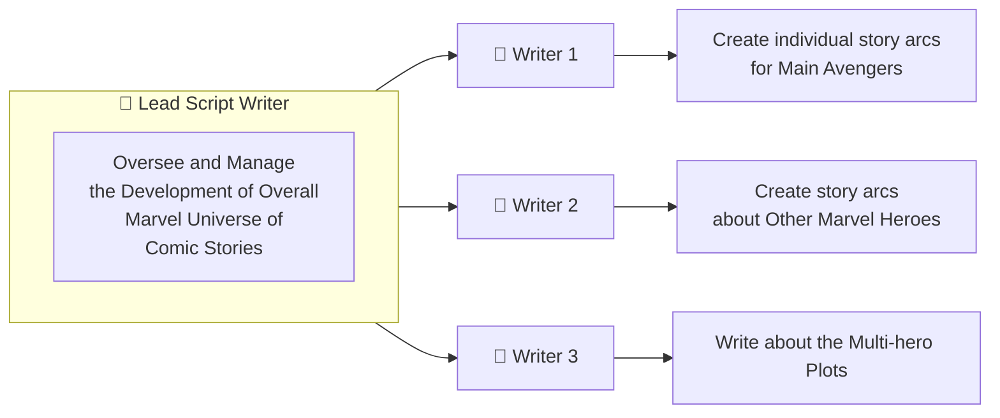

# fun-marvel-git-tutorial

> A Marvel-inspired Git Tutorial to help you transition from a beginner to an advanced Git User

---

## I. Team and Responsibilities

> A Team of 4 Writers are collaborating in Git to create amazing comic stories in the Marvel Universe

### About the Team 
- A Lead Script Writer at Marvel is tasked with creation of several comics. 
- He delegates the work to 3 writers with the following responsibilities

### Responsibilities

```mermaid
flowchart LR
    subgraph A[👤 Lead Script Writer]
        direction LR
        B[Oversee and Manage <br>the Development of Overall <br>Marvel Universe of <br>Comic Stories]
    end

    A --> C[👤 Writer 1]
    C --> D[Create individual story arcs<br> for Main Avengers]
    A --> E[👤 Writer 2]
    E --> F[Create story arcs <br>about Other Marvel Heroes]
    A --> G[👤 Writer 3]
    G --> H[Write about the Multi-hero Plots]
```

> Where do they Collaborate  - In `GitHub`