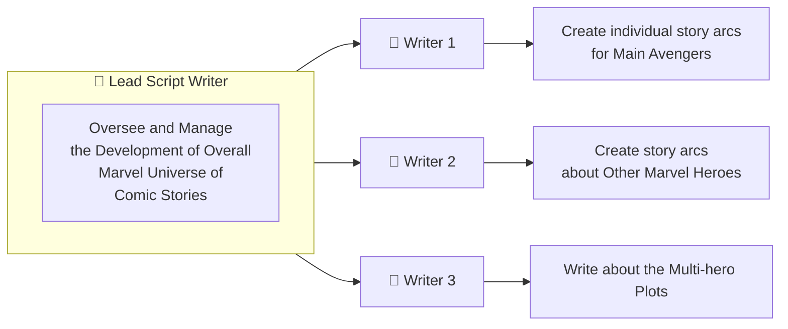

# fun-marvel-git-tutorial

> A Marvel-inspired Git Tutorial to help you transition from a beginner to an advanced Git User

---

## I. Team and Responsibilities

> A Team of 4 Writers are collaborating in Git to create amazing comic stories in the Marvel Universe

### About the Team 
- A Lead Script Writer at Marvel is tasked with creation of several comics. 
- He delegates the work to 3 writers with the following responsibilities


### Responsibilities


```mermaid
flowchart LR
    subgraph A[👤 Lead Script Writer]
        direction LR
        B[Oversee and Manage <br>the Development of Overall <br>Marvel Universe of <br>Comic Stories]
    end

    A --> C[👤 Writer 1]
    C --> D[Create individual story arcs<br> for Main Avengers]
    A --> E[👤 Writer 2]
    E --> F[Create story arcs <br>about Other Marvel Heroes]
    A --> G[👤 Writer 3]
    G --> H[Write about the Multi-hero Plots]
```

> Where do they Collaborate  - In `GitHub`

---

## II. Lead Script Writer's Initial Efforts

- Create a repo in remote. `git clone` locally 
- Push all initial ground work such as 
    - the context portions in `README.md` and 
    - the initial empty version of `marvel_heroes.md`
- Create 3 local branches for the three writers to write in


```bash
% # in `lead_script_writer` terminal
% git clone git@github.com-personal:senthilkumarm1901/fun-marvel-git-tutorial.git
% # enter into the git repo
% cd fun-marvel-git-tutorial.git

% # have your email and github user.name to be passed here
% git config user.email "senthilkumar.m1901@gmail.com" && git config user.name "senthilkumarm1901"

% # make 2 commits
% git add README.md && git commit -m "LeadScriptWriter: set initial context to the other 3 writers"
% git add marvel_heroes.md && git commit -m "LeadScriptWriter: create a file to collaborate"

% # commit all git commands made to `main` branch and 
% # push the changes to remote
% git add README.md && git commit -m "LeadScriptWriter: include all git commands executed"
% git push origin main
```

---

## III. Writer 1's Efforts

- Clone the repo
- Create a new branch `writer1/avengers` from `main`
- Made following commits
    - Update marvel_heroes.md with main avengers stories
    - Update marvel_heroes.md with other avengers stories
    - Add DeadPool to Avengers

```bash
% git add marvel_heroes.md && git commit -m "Writer1: Update marvel_heroes.md with main avengers stories"

% git add marvel_heroes.md && git commit -m "Writer1: Update marvel_heroes.md with other avengers stories"

% git add marvel_heroes.md && git commit -m "Writer1: Add DeadPool story to Avengers"

% git push origin writer1/avengers
```