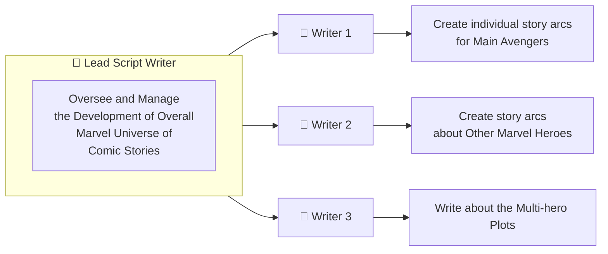

# fun-marvel-git-tutorial

> A Marvel-inspired Git Tutorial to help you transition from a beginner to an advanced Git User

---

## I. Team and Responsibilities

> A Team of 4 Writers are collaborating in Git to create amazing comic stories in the Marvel Universe

### About the Team 
- A Lead Script Writer at Marvel is tasked with creation of several comics. 
- He delegates the work to 3 writers with the following responsibilities


### Responsibilities


```mermaid
flowchart LR
    subgraph A[👤 Lead Script Writer]
        direction LR
        B[Oversee and Manage <br>the Development of Overall <br>Marvel Universe of <br>Comic Stories]
    end

    A --> C[👤 Writer 1]
    C --> D[Create individual story arcs<br> for Main Avengers]
    A --> E[👤 Writer 2]
    E --> F[Create story arcs <br>about Other Marvel Heroes]
    A --> G[👤 Writer 3]
    G --> H[Write about the Multi-hero Plots]
```

> Where do they Collaborate  - In `GitHub`

---

## II. Lead Script Writer's Initial Efforts

- Create a repo locally and in remote. 
- Push his initial ground work to the `main` branch

```bash
LeadScriptWriter@terminal lead_script_writer % mkdir -p fun-marvel-git-tutorial
LeadScriptWriter@terminal lead_script_writer % cd fun-marvel-git-tutorial 
LeadScriptWriter@terminal fun-marvel-git-tutorial % touch README.md marvel_heroes.md
LeadScriptWriter@terminal fun-marvel-git-tutorial % pwd
/Users/senthilkumar.m/my_learnings/udemy_courses/writers_place/lead_script_writer/fun-marvel-git-tutorial
LeadScriptWriter@terminal fun-marvel-git-tutorial % ls   
README.md		marvel_heroes.md
LeadScriptWriter@terminal fun-marvel-git-tutorial % cat marvel_heroes.md
> This is the file where all stories of different heroes converge
LeadScriptWriter@terminal fun-marvel-git-tutorial % git init                 
Initialized empty Git repository in /Users/senthilkumar.m/Library/CloudStorage/OneDrive-TOYOTAConnectedIndia/Learnings/udemy_courses/writers_place/lead_script_writer/fun-marvel-git-tutorial/.git/
LeadScriptWriter@terminal fun-marvel-git-tutorial % git config user.email "senthilkumar.m@gmail.com"
LeadScriptWriter@terminal fun-marvel-git-tutorial % git config user.name "senthilkumarm1901"
LeadScriptWriter@terminal fun-marvel-git-tutorial % git remote add origin git@github.com-personal:senthilkumarm1901/fun-marvel-git-tutorial-.git
LeadScriptWriter@terminal fun-marvel-git-tutorial % git remote add origin git@github.com-personal:senthilkumarm1901/fun-marvel-git-tutorial.git
LeadScriptWriter@terminal fun-marvel-git-tutorial % git status
On branch main

No commits yet

Untracked files:
  (use "git add <file>..." to include in what will be committed)
	README.md
	marvel_heroes.md

nothing added to commit but untracked files present (use "git add" to track)
LeadScriptWriter@terminal fun-marvel-git-tutorial % git add README.md && git commit -m "LeadScriptWriter: set initial context to the other 3 writers"
[main (root-commit) 8c3d5c5] LeadScriptWriter: set initial context to the other 3 writers
 1 file changed, 40 insertions(+)
 create mode 100644 README.md
LeadScriptWriter@terminal fun-marvel-git-tutorial % git add marvel_heroes.md && git commit -m "LeadScriptWriter: create a file to collate all stories"
[main 6e20a67] LeadScriptWriter: create a file to collate all stories
 1 file changed, 1 insertion(+)
 create mode 100644 marvel_heroes.md
LeadScriptWriter@terminal fun-marvel-git-tutorial % git push -u origin main
Enumerating objects: 6, done.
Counting objects: 100% (6/6), done.
Delta compression using up to 8 threads
Compressing objects: 100% (5/5), done.
Writing objects: 100% (6/6), 1.10 KiB | 1.10 MiB/s, done.
Total 6 (delta 0), reused 0 (delta 0), pack-reused 0
To github.com-personal:senthilkumarm1901/fun-marvel-git-tutorial.git
 * [new branch]      main -> main
branch 'main' set up to track 'origin/main'.

# remote branches
LeadScriptWriter@terminal fun-marvel-git-tutorial % git branch -r                           
  origin/main

# local branches
LeadScriptWriter@terminal fun-marvel-git-tutorial % git branch
* main
```