# fun-marvel-git-tutorial
> A Marvel-inspired fun Git Tutorial to help a coder transition from a beginner to an advanced Git User

---

## Team and Responsibilities

> A Team of 4 Writers are collaborating in Git to create amazing comic stories in the Marvel Universe

### About the Team 
- A Lead Script Writer at Marvel is tasked with creation of several comics. 
- He delegates the work to 3 writers with the following responsibilities

### Responsibilities

```mermaid
flowchart LR
    subgraph A[👤 Lead Script Writer]
        direction LR
        B[Oversee and Manage <br>the Development of Overall <br>Marvel Universe of <br>Comic Stories]
    end

    A --> C[👤 Writer 1]
    C --> D[Create individual story arcs<br> for Main Avengers]
    A --> E[👤 Writer 2]
    E --> F[Create story arcs <br>about Other Marvel Heroes]
    A --> G[👤 Writer 3]
    G --> H[Write about the Multi-hero Plots]
```

>[!IMPORTANT]
> Where do all Writers Collaborate - In `GitHub`  
> Each Writer can create a branch for them to commit their efforts  
> Upon completion of the work, they are expected to seek `Pull Request` Review for merging their branch with `main` where the Lead Script Writer comments and approves.  

---

## Lead Script Writer's Initial Efforts

- Create a repo in remote. `git clone` locally 
- Push all initial ground work such as 
    - the context portions in `README.md` and 
    - the initial empty version of `marvel_heroes.md`
- The writers are expected to contribute their efforts in their branches in the file `marvel_heroes.md`

----

>[!NOTE]
>The only file all writers are collaborating in is `marvel_heroes.md`

---